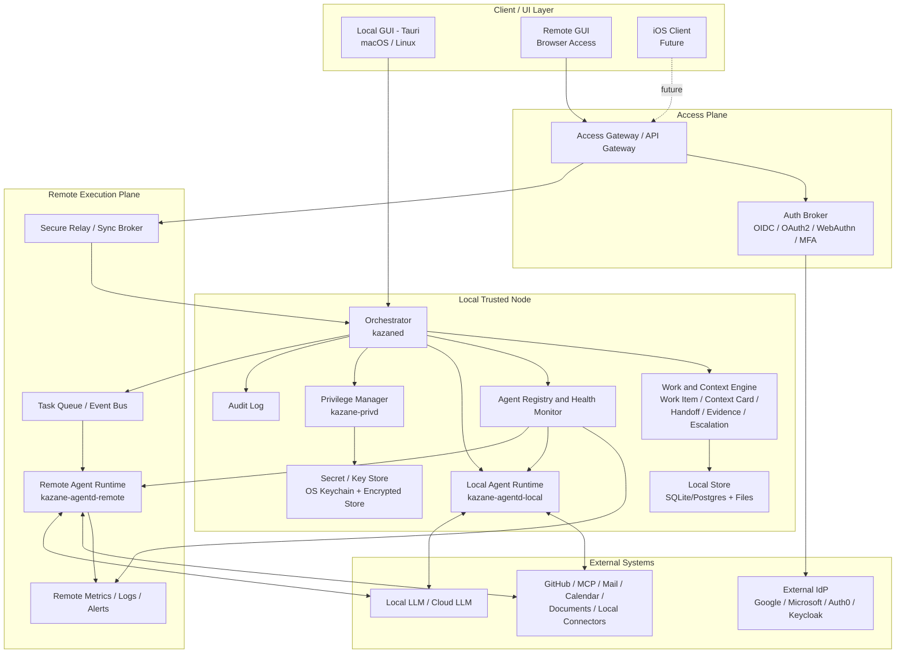
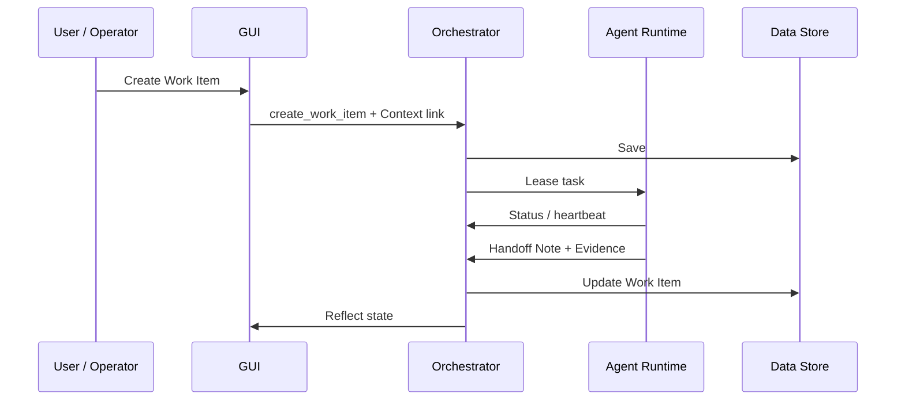
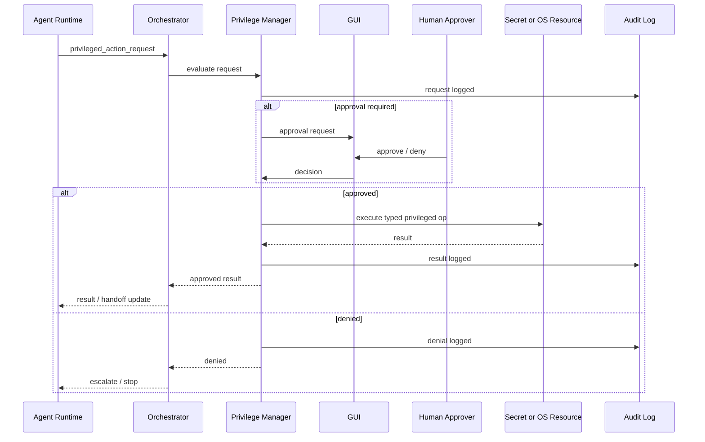
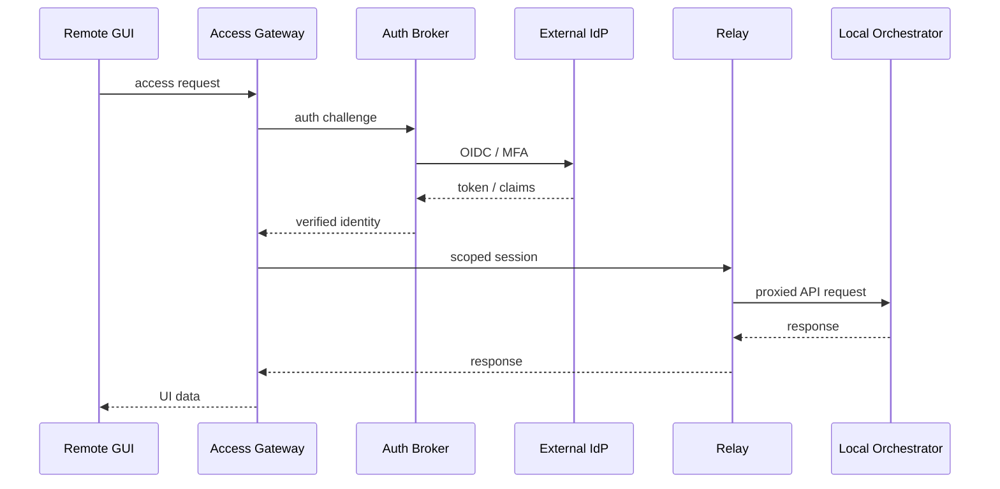

# Kazane Architecture v2

This document describes the overall Kazane architecture after adopting a Tauri-first runtime and adding local orchestration, privilege management, distributed agent execution, monitoring, remote/local GUI access, external authentication, and a security foundation.

## Architectural stance

Kazane is not a single GUI application. It is a local-first work operating system with distributed execution.

The local node owns the primary context and decision flow. Remote components may execute work, expose limited GUI access, or provide monitoring, but they should not become the uncontrolled source of truth.

## Planes

Kazane is organized into six planes:

1. **Access Plane**: local and remote GUI access, external authentication, scoped sessions.
2. **Control Plane**: local orchestrator, work state, context flow, dispatch, leases, escalation.
3. **Execution Plane**: local and remote agent runtimes.
4. **Security Plane**: privilege manager, policy, secrets, audit, sandboxing.
5. **Data Plane**: Work Items, Context Cards, Handoff Notes, Evidence Logs, approvals, audit events.
6. **Observability Plane**: distributed agent health, silent failure detection, metrics, alerts.

## Logical architecture

## Core local processes

### `kazaned` — Local Orchestrator

The orchestrator is the local control-plane process. It owns workflow semantics and responsibility boundaries.

Responsibilities:

- create and update Work Items;
- link Work Items to Context Cards;
- dispatch tasks to local or remote agent runtimes;
- issue and revoke execution leases;
- receive Handoff Notes;
- collect Evidence Logs;
- evaluate Escalation Gates;
- coordinate review and T-RDE/RDE checks;
- write audit events.

The orchestrator should not be treated as a mere API server. It is the process that preserves Kazane's meaning model.

Phase A runs `scripts/kazaned` as a separate local Unix-socket service. MCP
read operations remain read-only SQLite queries, while create/update/Handoff/
Evidence/Mail/Calendar writes are sent to `kazaned` as typed JSON operations.

### `kazane-privd` — Privilege Manager

The privilege manager is isolated from the agent runtime. It evaluates privileged operation requests and executes only typed, policy-approved operations.

Responsibilities:

- capability-based authorization;
- policy evaluation;
- secret retrieval through OS keychain or encrypted store;
- approval workflow for high-risk actions;
- audit record creation;
- denial and escalation.

Agent runtimes should not receive direct access to secrets or arbitrary privileged operations.

Phase A runs `scripts/kazane-privd` separately. It authorizes only known typed
operations from known Agent Profiles, applies Gate stops, defaults to deny, and
records allow/deny decisions. Secret access and privileged execution are not
implemented in Phase A.

### `kazane-agentd-local` — Local Agent Runtime

The local agent runtime handles work that should remain near the user's machine, local files, and local context.

Best suited for:

- sensitive local context;
- local file operations;
- local model usage;
- quick iterative tasks;
- owner-only workflows.

### `kazane-agentd-remote` — Remote Agent Runtime

Remote runtimes handle long-running, parallel, or resource-heavy work.

Best suited for:

- nightly QA;
- large review batches;
- remote model execution;
- partner integrations;
- low-sensitivity background processing.

Remote execution must always remain within capability, policy, and evidence constraints.

## GUI model

### Local GUI

The primary local GUI is Tauri-based.

It may access the local orchestrator directly through local IPC or Tauri commands. It can provide full owner/operator workflows, including approvals for sensitive actions.

### Remote GUI

The remote GUI is a browser-accessible interface behind an Access Gateway and Auth Broker.

It should not directly touch the local database. It should communicate through a relay or scoped API path.

### iOS client

iOS is a future target. It should initially focus on:

- monitoring;
- approval;
- notifications;
- lightweight review;
- read-mostly dashboards.

Full desktop parity is not an initial promise.

## Work object flow

Kazane's core objects are:

- Work Item;
- Context Card;
- Handoff Note;
- Evidence Log;
- Escalation Gate;
- Agent Profile;
- Approval Record;
- Audit Event.

Relationship rules:

- Work Items reference Context Cards.
- Agents acquire Work Items through leases.
- Agent output becomes Handoff Notes.
- Sources and tool results become Evidence Logs.
- High-risk actions pass through Escalation Gates.
- Human approvals become Approval Records.
- Important transitions produce Audit Events.

## Normal task flow

## Privileged operation flow

## Remote GUI access flow

## Initial implementation phases

### Phase A: local skeleton

- Tauri GUI;
- `kazaned`;
- `kazane-privd`;
- local SQLite;
- Work Item and Context Card;
- local agent runtime;
- audit log.

### Phase B: AI execution

- agent lease;
- Handoff Note;
- Evidence Log;
- Needs Human;
- permissioned tool calling.

### Phase C: distribution

- remote runtime;
- queue;
- heartbeat;
- monitoring dashboard.

### Phase D: external access

- relay;
- OIDC;
- remote GUI;
- role-scoped access.

### Phase E: iOS horizon

- approval-oriented mobile flows;
- notification;
- read-mostly dashboards.

## Architectural risks

- Tauri-specific assumptions may leak into core models.
- Remote execution may weaken local context sovereignty if not constrained.
- Privilege Manager may become too permissive if it exposes generic shell operations.
- Remote GUI may accidentally become a cloud-first architecture.
- Monitoring may focus on uptime while missing semantic failures.

## RDE check

- Preserved: local-first, context sovereignty, written handoff, evidence, escalation, and human responsibility.
- Transformed: Kazane becomes multi-process and distributed rather than a single Tauri app.
- Supplemented: privilege boundary, remote execution, external authentication, and observability planes.
- Unresolved: concrete IPC, storage, queue, policy engine, and mobile scope.
- Deviation risk: architecture may become too heavy for v0.0 if not phased.
- Next update: define Phase A process boundaries and v0.1 schemas.
