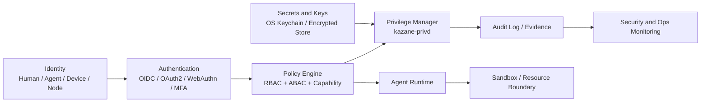

# Security Architecture

Kazane manages organizational context, local files, agent work, external connectors, and human approvals. Security is therefore a product architecture concern, not a deployment afterthought.

## Security goals

Kazane should:

- keep the local node as the primary trust anchor;
- isolate privileged operations from AI agent runtimes;
- require explicit approval for high-risk actions;
- support external authentication for remote GUI access;
- maintain evidence and audit records for important operations;
- detect silent failures and policy drift;
- support distributed agents without granting them broad implicit trust.

## Security planes



## Identity model

Kazane should distinguish:

- human user identity;
- agent identity;
- device identity;
- node identity;
- service identity;
- connector identity.

A remote agent is not simply a user. It must have its own identity, capability manifest, runtime version, policy version, and heartbeat.

## Authentication

### Local GUI

The local Tauri GUI may rely initially on OS session trust, but should allow app-level authentication later for owner/operator mode.

Possible future local factors:

- OS login;
- passkey;
- biometric unlock where available;
- local operator PIN for high-risk approvals.

### Remote GUI

Remote GUI access must go through an Access Gateway and Auth Broker.

Recommended mechanisms:

- OIDC / OAuth2;
- WebAuthn / passkey;
- MFA;
- short-lived access tokens;
- role and scope claims.

Possible identity providers:

- Keycloak;
- Auth0;
- Google Workspace;
- Microsoft Entra ID;
- Zitadel.

Remote GUI must not directly access local storage.

## Authorization

Kazane should use a layered authorization model.

### RBAC

Example roles:

- Owner;
- Operator;
- Reviewer;
- Agent Maintainer;
- Observer;
- Remote Approver.

### ABAC

Attributes may include:

- project;
- customer;
- sensitivity level;
- data class;
- node;
- time window;
- network origin;
- work type.

### Capability model

Agents receive explicit capabilities.

Examples:

- read_context;
- write_handoff;
- create_work_item;
- propose_file_change;
- request_privileged_action;
- call_connector;
- read_evidence;
- request_human_review.

Capabilities should be narrow and typed.

## Privilege Manager

The Privilege Manager is a separate process: `kazane-privd`.

It should never be embedded inside an agent runtime.

Responsibilities:

- evaluate privileged requests;
- check policy;
- retrieve secrets only when allowed;
- request human approval when required;
- execute typed privileged operations;
- write audit events;
- deny or escalate unsafe requests.

### Phase A implementation

The local Phase A boundary is implemented as three Unix-socket processes:

- `kazaned` owns all MCP state-changing operations;
- `kazane-privd` authorizes typed requests against Agent Profile Gate stops;
- `kazane-agentd` delivers task assignment notifications.

The MCP server requires an `agent_id` for every write. Missing identities,
unknown agents, unknown operations, and Gate-stop matches are denied by default.
Every decision is stored in `privileged_operation_requests`. Phase A does not
yet retrieve secrets or execute arbitrary commands; those remain prohibited.

## Privileged operation model

Agents should request typed operations rather than arbitrary shell access.

Examples:

```text
read_secret(name)
write_workspace_file(path, content, scope)
execute_command_profile(profile_id, args)
call_connector(connector_id, operation, scope)
send_draft_email(template_id, recipient_scope)
git_create_branch(repo, branch)
git_open_pr(repo, branch, base)
```

High-risk operations must require human approval.

## Secrets

Secrets should be stored outside agent-readable state.

Recommended layers:

- OS Keychain / Secret Service;
- encrypted local vault;
- optional remote secret broker later;
- redaction in Evidence Logs;
- no plaintext secrets in Context Cards, Handoff Notes, or Work Items.

## Runtime isolation

Agent runtimes should be isolated according to risk.

Possible mechanisms:

- separate process;
- restricted working directory;
- scoped filesystem access;
- command allowlist;
- network egress controls;
- container or VM for remote runners;
- resource limits;
- no direct secret access.

## External connectors

Connectors should be treated as privileged resources.

Connector access should record:

- who or which agent requested access;
- which connector was used;
- which operation was called;
- which Work Item caused it;
- which evidence was produced;
- whether human approval was required.

## Remote execution

Remote runtimes must operate through leases and scopes.

Remote agents should not have permanent broad access. Each assignment should include:

- Work Item ID;
- allowed context scope;
- allowed tools;
- lease duration;
- expected output format;
- handoff requirement;
- evidence requirement;
- escalation rules.

## Remote GUI access

Remote GUI is a scoped access surface.

Design rules:

- remote GUI uses external authentication;
- remote GUI receives scoped data only;
- remote GUI cannot bypass the orchestrator;
- high-risk operations require additional approval;
- read-only and approval-only roles should be available;
- remote GUI access is audited.

## Audit and Evidence

Kazane should distinguish:

- **Evidence Log**: work-relevant sources and artifacts.
- **Audit Log**: security-relevant operations and decisions.

Both may refer to the same event, but they serve different purposes.

Audit events should include:

- timestamp;
- actor identity;
- node identity;
- operation;
- Work Item ID;
- policy decision;
- approval record if any;
- result;
- evidence reference if any.

## Silent failure monitoring

Kazane must monitor more than process uptime.

Security-relevant silent failures include:

- Done state without Handoff;
- Handoff without Evidence;
- privileged action without approval record;
- agent heartbeat missing;
- connector access without Work Item link;
- policy version mismatch;
- capability manifest drift;
- repeated denied operations;
- stale remote leases;
- broken evidence references.

## Initial security boundary

Phase A should implement at minimum:

- local orchestrator;
- separate privilege manager interface, even if simple;
- typed operation requests;
- local audit log;
- no plaintext secret storage in work objects;
- clear deny behavior for unknown operations.

## RDE check

- Preserved: human responsibility, local-first context, written evidence, and escalation.
- Transformed: security is modeled as a core plane rather than deployment detail.
- Supplemented: identity, capability, privilege isolation, external authentication, and audit design.
- Unresolved: concrete policy engine, vault implementation, remote relay trust model.
- Deviation risk: security complexity may exceed early prototype needs.
- Next update: define Phase A privilege request schema and audit event schema.
